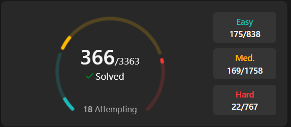

<h1>Hi there 👋</h1>
<h1 align="center">

 

</h1>
<h3 align="center">  Full Stack Developer | Programmer | Computer Science & Engineering | Leetcoder</h3>

- 🏅 I’m currently learning **Data Structures & Algorithms**

  

<picture>
  <source media="(prefers-color-scheme: dark)" srcset="https://github.com/TuShArBhArDwA/TuShArBhArDwA/blob/output/github-contribution-grid-snake.svg">
  <source media="(prefers-color-scheme: light)" srcset="https://github.com/TuShArBhArDwA/TuShArBhArDwA/blob/output/github-contribution-grid-snake-dark.svg">
  
</picture>
